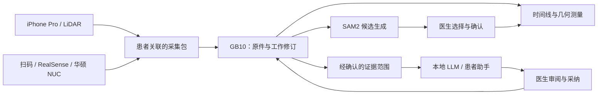

# 创视迹技术栈：从采集现场到本地智能工作台

2026-09-23 提交前草稿。本文以“采集—测量—跟踪—AI 辅助—医生确认”为主线，说明技术选择如何服务医生。源码核对基线为 50def82；采集设备部分依据团队已提供的实现说明，具体型号和硬件实拍由团队补齐。

## 1. 端侧采集与中心计算的分工

创视迹将靠近患者的采集工作与模型计算分开。iPhone Pro LiDAR 提供移动采集方式；RealSense 深度相机与华硕 NUC 组合承担另一种现场采集方式。采集端关联患者身份，记录彩图、深度及相机参数。GB10 承担 Web 管理、证据组织和本地 AI 计算，浏览器承担查看与交互。

图中表示逻辑数据流，不承诺采集设备已实现无人值守网络同步；当前具体传输方式在演示环境说明中记录。

## 2. 分层选型与输入输出

| 层次 | 技术 | 选择原因 | 输入 → 输出 |
|---|---|---|---|
| 移动采集 | iPhone Pro LiDAR、原生采集应用 | 将彩图与空间数据关联保存，便于移动使用 | 患者关联＋传感器数据 → 采集记录 |
| 现场采集设备 | RealSense＋华硕 NUC、扫码交互 | 在独立设备中组织患者关联和 RGB-D 采集 | 扫码信息＋彩图/深度 → 带相机参数的记录 |
| 临床数据层 | WREC、JSON 元数据、工作修订 | 原件与后续编辑分开，保留来源 | 原始包＋明确编辑 → 可追溯工作视图 |
| 管理与交互 | React、TypeScript、Vite | 同屏组织图像、测量、时间线与对话 | 结构化 API → 医生可操作的工作台 |
| API 与计算 | Python、FastAPI、NumPy、Pillow | 组织证据、图像处理和几何计算 | 有效标定与深度 → 测量；获准范围 → 快照 |
| 本地语言/视觉模型 | Ollama 兼容接口、Qwen 配置 | 将临床推理留在受控本地服务 | 文本证据＋确认图片 → 待审回复 |
| 分割 | SAM2、独立模型 worker | 生成多个区域候选供医生选择 | 当前帧与提示 → 蒙版、质量信息、候选 |
| 专业能力包 | Agent Skills 文档、manifest、适配器与评测 | 使能力、边界和依赖可被审查 | 冻结证据 → 只读切片/流程指导 |

## 3. 物理测量的数据链

像素位置需要对应到正确的深度样本，再由相机内参和位姿映射到空间。创视迹遵循 geometryV1 的既定计算合同，保留长度、面积与剖面的单位和来源。面积应按该合同的平面投影定义解释，不宣传为任意曲面的真实表面积。

帧数组位置与原始采集编号分别保存；深度无效、位姿异常或标定不一致时，系统不能用默认值凑出有效结果。正式精度报告还需要标准物体、参考量具、采集距离与重复测量条件，现有代码和单元测试不能代替这项验证。

## 4. NVIDIA 平台、模型与 SDK

GB10 在本方案中的核心作用是提供本地模型计算平台。SAM2 worker 使用模型框架，LLM 通过本地推理服务调用；应用主链路尚无经本材料验证的 TensorRT-LLM、NIM 或自研 CUDA kernel 集成。使用 NVIDIA GPU 与集成特定 SDK 是不同事实，应分别披露。

| 项 | 当前依据 | 提交前记录 |
|---|---|---|
| API 依赖 | requirements.txt：FastAPI 0.116.1、NumPy 2.3.2、Pillow 11.3.0 | 固定源码与环境导出 |
| SAM2 依赖 | requirements-sam2.txt 单列 Transformers、OpenCV 等 | 另锁定 torch、CUDA、驱动与权重版本 |
| 模型选择 | 源码默认 qwen3.6:35b，本地固定端点 | 录制时实际模型 tag、摘要、许可证及运行时 |
| SAM2 环境 | 团队 9/22 报告记录 torch 2.9.1+cu130、CUDA 13.0、sam2.1-hiera-tiny | 报告不是本轮实测，拍摄前重新记录 |
| StepFun | 当前无已验证接入证据 | 如实写未接入，不以计划代替成果 |

量化格式或长上下文配置来自模型运行记录，不宣称为团队完成的量化研究，也不说明应用实际发送了整个上下文窗口。

## 5. Agent 与 Skills 所处位置

原生端有基于 Pi 的 Agent 实践；GB10 Web 使用后端 grounded 证据流程，不能合称一个已经统一的 Pi 运行时。当前生产路径先由服务器读取证据，再调用一次模型完成回复。四个 publishable 技能包复用内部工具，另有一个 SAM2 预览技能；生产不动态加载 publishable manifest。详情见 [Agent 与 Skills 设计](08_Agent与Skills设计说明.md)。

## 6. 数据保护与医生工作流

本地推理减少向外部模型服务发送医疗资料的需求。浏览器访问、数据导入导出和备份仍有独立边界。会话保存、备注采纳和测量确认分别处理，不能把 AI 输出自动写成医生签署内容。访问角色也不等于可验证的个人临床身份。

公开技术表应保留上述结构，但删除内部主机路径、网络入口及凭据。发布前补上实际设备型号、相机型号、版本锁、许可和合成复现证据；不公开模型权重或真实患者记录。
