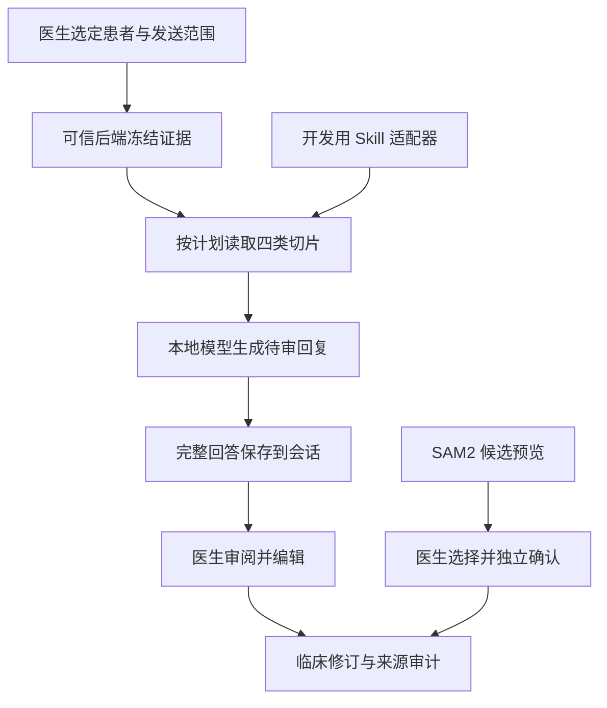

# 面向创面管理的 Agent 与 Skills 设计

2026-09-28。代码基线 `cb8f27b`，与仓库里的二进制来源一致。目标是帮助医生在明确证据范围内查阅、整理和审阅；模型不拥有自主临床写入权。

## 1. 从医生的问题到有依据的回答

医生可能问：“整理这名患者已有的测量和备注”“这次记录还缺哪些信息”“请结合当前图像解释已有记录”。这些问题首先涉及身份、时间、版本和图片范围，其次才是语言生成。

Web 后端构造请求级快照，核对当前范围与修订版本，依次读取 overview、measurements、notes、integrity 四类证据。任何证据计划项被拒绝时，不继续生成看似完整的答案。读取完成后，证据与获准图像一起送往本地模型。生产 grounded 路径是一次模型生成；另有多轮工具循环实现用于测试，不能据此称生产具备多智能体协作。

## 2. 当前图像与持久会话

“当前图像”必须对应真实附图。应用核对录像归属、数组位置与原始帧编号，将图片信息绑定快照。换帧需要重新准备范围；无可靠帧号时采用纯文本请求，不携带旧帧身份。医生原话独立保存，程序附加上下文不冒充用户输入。

患者页、看图页与助手页共享会话组件。完整回复可持久化；流式响应必须正常完成，不能把半截回答记成成功。医生选择采纳时再次审阅，可编辑最终正文，然后通过独立临床修订流程写入并保留来源审计。

## 3. 五个技能包的设计

| 包 | 触发需求 | 输入与输出 | 关键边界 | 对应验证 |
|---|---|---|---|---|
| woundtruth-integrity-verify | 核对资料是否完整、来源是否可说明 | 已获准快照中的完整性证据 → 状态及缺失信息 | 不重新把签名解释为医学质量，也不访问任意路径 | 完整/缺失/非法状态、适配器与生产切片一致性 |
| woundtruth-measurement-review | 整理已保存长度、面积与剖面 | 已保存测量切片 → 数值、单位与关联信息 | 不从 RGB 像素自行推导物理量，不把长度改名为面积 | 量纲合同与拒绝用例 |
| woundtruth-note-draft | 为病程整理准备备注素材 | 已保存备注切片 → 有来源的草稿素材 | 包自身不等于生成模型；不自行采纳、签署或写入 | 只读性、角色边界及采纳审计测试 |
| woundtruth-record-review | 回顾完整获准记录 | 按顺序组合四类证据 → 总览所需素材 | 不跨患者扩大范围，不隐瞒缺失证据 | 证据计划、顺序和完整覆盖测试 |
| woundtruth-sam2-measurement-preview | 审阅分割候选或进行提示修正 | 主机提供的当前帧与候选 → 审阅流程、质量解释 | 不判断区域一定是创面，不由 Agent 调用确认写入 | 候选身份、质量拒绝、正式确认与 pending 回归 |

前四项以适配器包装已有只读工具，最后一项指导独立 SAM2 应用流程。这五项不是五个同时自主行动的 Agent。

## 4. 只读工具与写入事务分开

图中适配器与生产流程共享证据实现，不表示生产加载适配器。模型输出不提供新的患者路径、几何坐标或未授权工具参数作为写入依据。正式测量确认使用被冻结的候选身份和修订版本，服务端重新核对几何与来源。

已保存后又被编辑的测量继续保持既定审计保护边界；不能自动弃标或补造来源收据。角色、显式 UI 操作与个人签名是不同概念，不能编造签署人。

## 5. 开放规范与当前兼容性状态

技能以 SKILL.md、参考文档、manifest、验证器和评测材料组织。NVIDIA Skills 基于开放 Agent Skills 规范；这提供可移植的组织方式，不表示本项目获得 NVIDIA Verified 或医疗认证。[开放规范](https://agentskills.io/specification)、[NVIDIA 文档](https://docs.nvidia.com/skills)。

本仓库五个 `SKILL.md` 的 `version` 写在 `metadata` 下，顶层没有 `version`。这按公开字段表对齐。本仓库没有附带一次官方校验器的实跑记录，也不写成已经通过官方认证。

自定义 manifest 的只读、网络、文件系统和参数声明属于项目约束，不自动成为客户端执行的权限机制。正文约束、后端授权、适配器校验和测试需要共同成立。

## 6. 能力约束如何验证

| 场景 | 应观察到的结果 | 证据文件 |
|---|---|---|
| 非空工具参数/越权范围 | 拒绝，不扩大快照 | test_agent_runtime.py、test_publishable_adapter_scope.py |
| 模型要求凭像素给厘米 | 拒绝该能力或说明缺失条件 | test_measurement_dimension_contract.py、技能 evals |
| 患者/帧身份不一致 | 不作为当前图像发送 | test_patient_assistant_snapshot.py、Assistant.request.test.tsx |
| 流被截断 | 未完成，不记录成功答复 | test_assistant_stream.py |
| 旧版本提交或审计未完成 | 冲突/保留 pending，不绕过来源 | test_sam2_confirmation.py |
| 只读包装与内部实现漂移 | 对照测试失败 | test_publishable_layer.py 等 |

测试通过证明对应工程条件，不能证明临床正确性。有无技能的对照协议、合成表和结论见[部署与模型优化说明](03_部署与模型优化说明.md)第 5 节。那一节的范围是：技能已被指定后，追加正文是否改变越界回答。它不代替上表里的工程测试。

## 7. 演示方式

先展示患者问题、确认范围和证据轨迹，再展示一份技能的输入/边界与一个拒绝例。用 30–45 秒说明“模型可以辅助，但谁能看什么、谁能写什么由系统和医生决定”。不要用五个文件名代替真实流程，也不演示未经审查的任意 Shell 能力。
