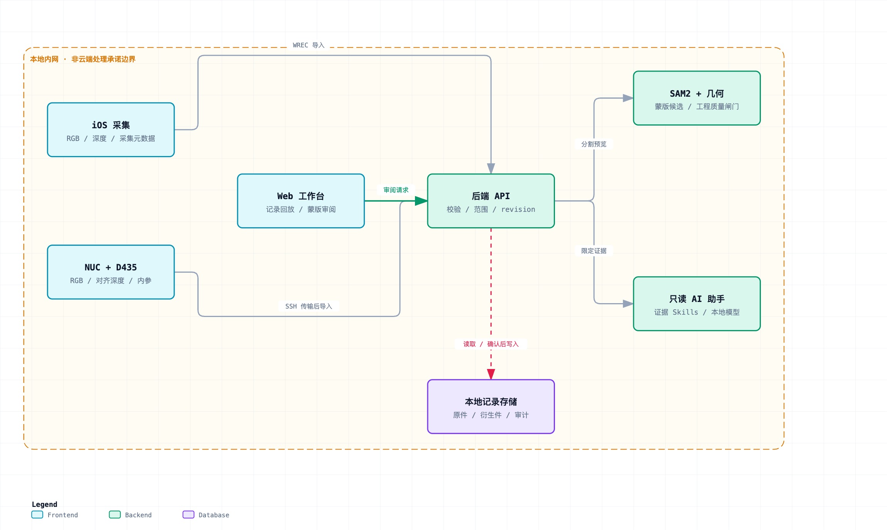
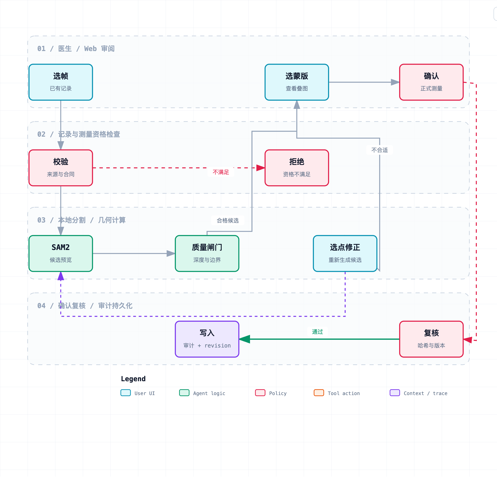
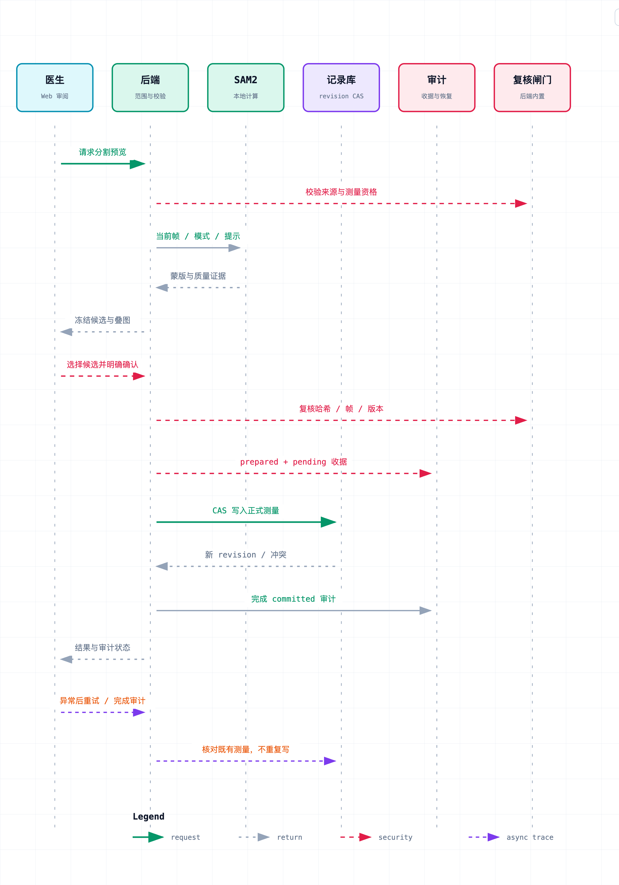
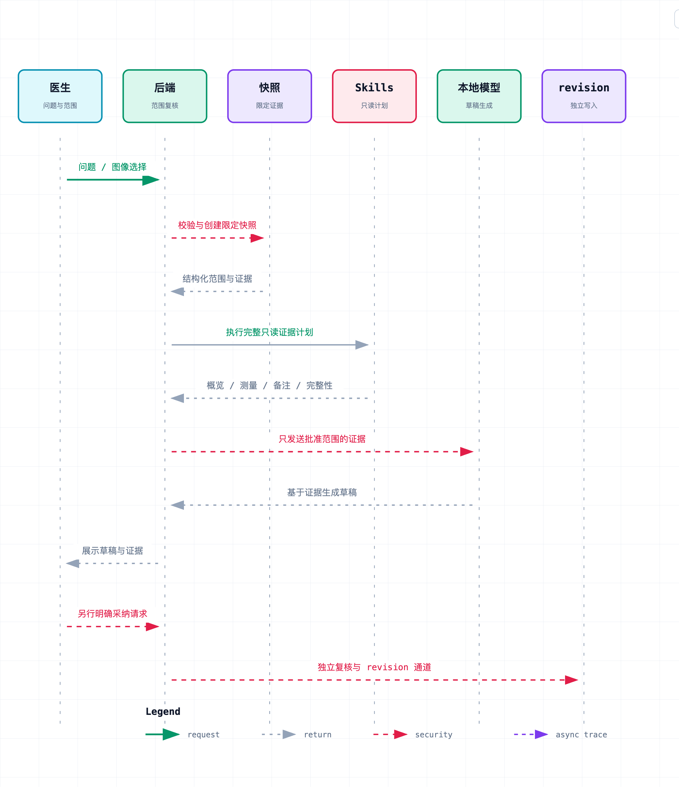
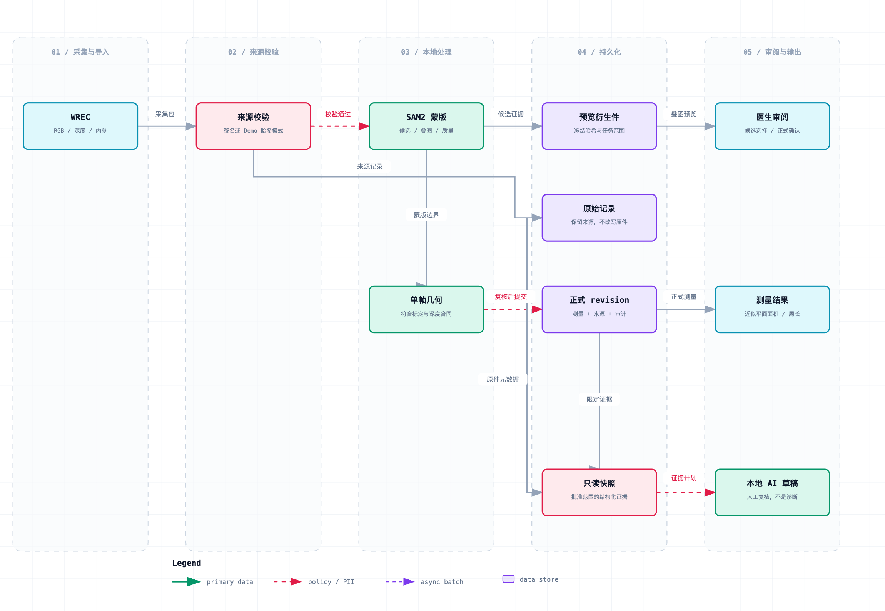

# 技术图

这五张图说明采集、测量和辅助评估怎么接在一起。PNG 可以直接看，SVG 是同一张图的矢量文件。

## 架构

iOS 与 NUC 采集、Web 工作台、后端、SAM2、只读助手和本地记录。

## 测量流程

选帧、来源校验、分割与质量检查、医生选蒙版或改点、确认后复核写入。

## SAM2 确认

冻结候选，医生明确确认，服务器复核哈希与版本，再写入正式测量并留下审计。

## 助手时序

先冻结这次获准的证据，只读技能取出概览、测量、备注和完整性，本地模型生成草稿。采纳走单独的确认。

## 数据流

原始采集、预览衍生件、正式测量和限定范围的证据彼此分开。

